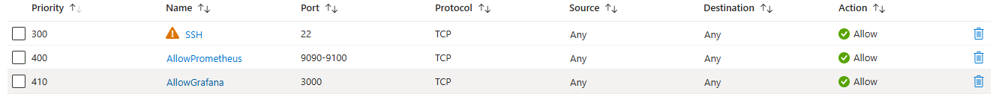
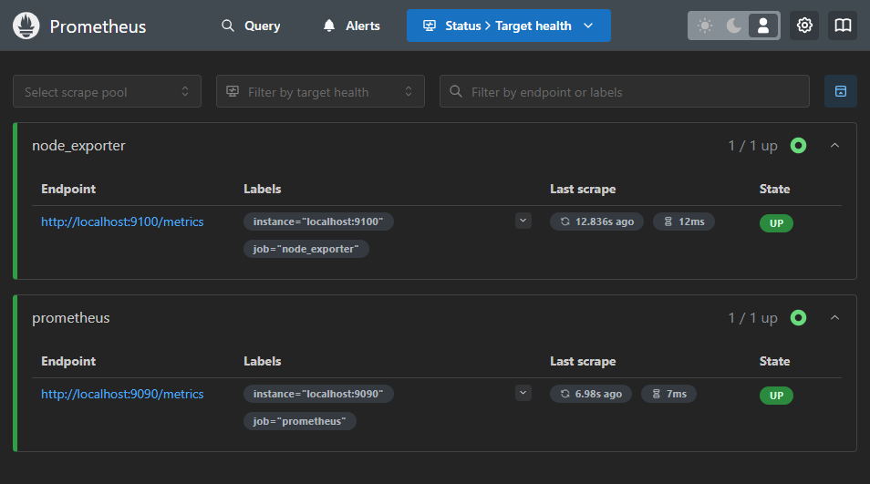
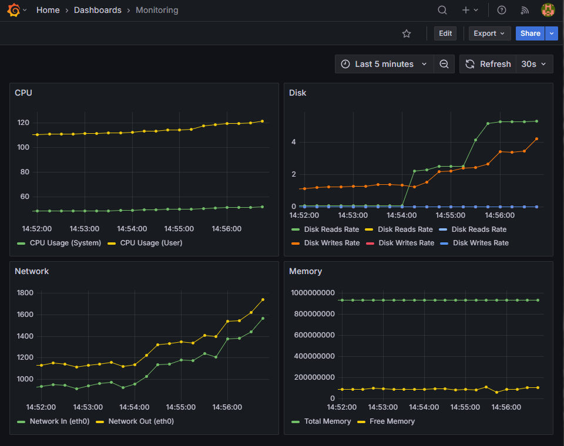

# Azure DevOps Monitoring Project

This project focuses on setting up a monitoring solution for an Azure virtual machine (VM) using Prometheus and Grafana. It aims to collect and visualize real-time system metrics such as CPU usage, memory, disk space, and network traffic (both inbound and outbound), providing an efficient way to monitor and manage the VM's overall performance.

## Table of Contents

1. [Setup Overview](#setup-overview)
2. [Monitoring Script](#monitoring-script)
3. [Prometheus and Grafana Installation](#prometheus-and-grafana-installation)
4. [CI/CD Pipeline](#cicd-pipeline)
5. [Screenshots](#screenshots)

---

## Setup Overview

In this project, an **Azure** virtual machine was created and configured for monitoring. **Prometheus** and **Grafana** were set up to track system metrics such as CPU, disk, memory usage, and network traffic (both inbound and outbound).

The steps for setting up this project include:

1. **Creation of an Azure VM** for monitoring.
2. **Connection via SSH** using **WSL**.
3. Installation and configuration of **Prometheus** and **Grafana** for metrics collection and visualization.
4. Automation of the process using a **CI/CD pipeline**.

---

## Monitoring Script

A **Bash script** named `monitoring.sh` was written to monitor key system metrics such as:

- **CPU usage**
- **Disk space**
- **Memory usage**
- **Network traffic**

These metrics are collected and sent to **Prometheus** for monitoring. The **Node Exporter** is used to collect system data, which is then scraped by **Prometheus**.

Additionally, **Azure inbound rules** were configured to allow traffic for **Prometheus** and **Grafana**, enabling proper data collection and visualization.

---

## Prometheus and Grafana Installation

### Prometheus

- **Prometheus** was installed on the Azure VM to collect and store system metrics.
- It collects metrics from **Node Exporter**, which monitors system health.
  
### Grafana

- **Grafana** was installed and connected to Prometheus as the data source.
- A custom **Grafana Dashboard** was created to visualize the collected metrics in an easy-to-read format.

This setup allows for real-time monitoring of the VM’s performance, providing insights into system resource usage over time.

---

## CI/CD Pipeline

This project uses an automated **CI/CD pipeline** to simplify the process of updating and deploying the monitoring script. The pipeline consists of two main stages:

### 1. Build Stage
In this stage, the code is checked out, and SSH is configured for secure access to the Azure VM. The `monitoring.sh` script is retrieved from the VM and verified for errors using **ShellCheck**. A timestamp is then added to track updates, and any changes are committed to the repository.

### 2. Deploy Stage
In this stage, the old version of the script is backed up on the VM before the updated version is deployed with the appropriate permissions. A health check is then performed to ensure the script is functioning correctly. If any issues are detected, the previous version is restored to maintain stability.

This CI/CD setup ensures automated updates to the monitoring script with minimal manual effort.

---

## Screenshots

Here are some screenshots showing the setup and dashboards:

1. **Azure Inbound Rules**  
   *Description: Configuration in Azure to allow traffic for Prometheus and Grafana.*  
   
   
2. **Prometheus and Node Exporter Metrics**  
   *Description: Displays the metrics collected by Prometheus, showing system data from both the VM and the Node Exporter.*  
   

3. **Grafana Dashboard**  
   *Description: Custom Grafana dashboard visualizing the collected metrics.*  
   

